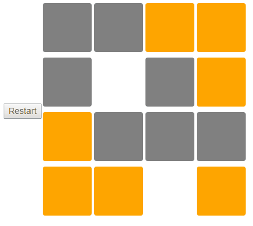

# A simple game made with Elm

This is a simple game to illustrate how to code apps in Elm. 

## Setup 

This repo uses `Elm Platform`, `nodejs` and `webpack`. 

To get you started run `npm install` then `elm package install` and start the server with `npm start`

### Elm tutorial for this game

* [Part 1](https://www.youtube.com/watch?v=R6vuO547DC8)
* [Part 2](https://www.youtube.com/watch?v=OAgF2uUnKcg)